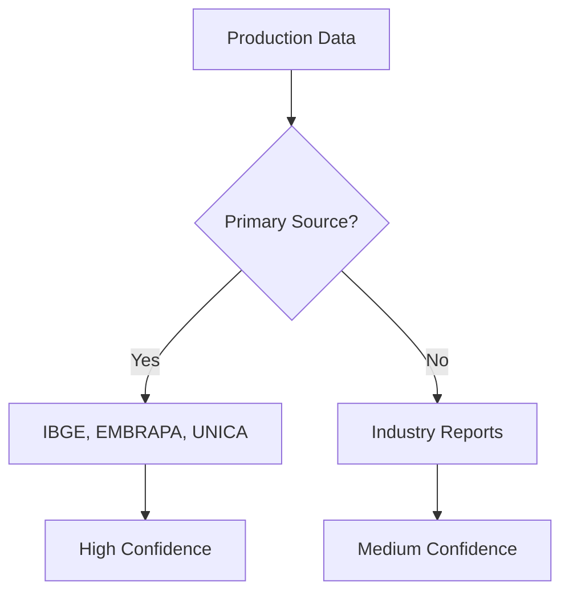

# 📐 FDE Methodology - Fator de Disponibilidade Efetivo

**Version:** 2.0
**Updated:** 2025-11-22
**Purpose:** Define and explain the FDE (Effective Availability Factor) calculation methodology

---

## 🎯 What is FDE?

**FDE (Fator de Disponibilidade Efetivo)** is the **Effective Availability Factor** that represents the realistic percentage of a residue that can be converted into biogas energy, considering:

1. **Physical Availability** - How much substrate is actually collectible
2. **Competing Uses** - Alternative utilization pathways that reduce biogas potential
3. **Conversion Efficiency** - Technical limitations of anaerobic digestion
4. **Regulatory Constraints** - Legal requirements that limit availability

---

## 📊 FDE Calculation Formula

### **Simple Formula**

```
FDE = Availability × Efficiency

Where:
- Availability = Fraction collectible for biogas (0-1)
- Efficiency = Anaerobic digestion conversion efficiency (0-1)
```

### **Detailed Formula**

```
FDE = (1 - Competing_Uses) × Collection_Factor × η_conversion

Components:
1. Competing_Uses = Σ(alternative_utilization_i) [0-1]
2. Collection_Factor = Geographic_feasibility × Logistics_viability [0-1]
3. η_conversion = Digestor_efficiency × Substrate_degradability [0-1]
```

### **Example: Cattle Manure**

```python
# Step 1: Competing Uses
free_range = 0.40  # Dispersed in pastures (not collectible)
direct_soil = 0.20  # Used as fertilizer directly
composting = 0.10   # Composted for organic fertilizer
unmanaged = 0.05    # Improper storage/disposal

competing_uses_total = 0.40 + 0.20 + 0.10 + 0.05 = 0.75

# Step 2: Available for Biogas
availability = 1 - 0.75 = 0.25 (25%)

# Step 3: Collection Factor (confined systems only)
confined_systems = 1.00  # Already collected in confined operations

# Step 4: Conversion Efficiency
digestor_efficiency = 0.85  # 85% of theoretical BMP
substrate_degradability = 1.00  # Good substrate for AD

η_conversion = 0.85 × 1.00 = 0.85

# Final FDE Calculation
FDE = 0.25 × 1.00 × 0.85 = 0.2125

Result: FDE = 21.25%
```

This means **21.25% of total cattle manure production** can effectively be converted to biogas energy.

---

## 🔍 FDE vs Traditional Metrics

| Metric | Definition | Limitations |
|--------|------------|-------------|
| **BMP** (Biochemical Methane Potential) | Lab-measured max CH₄ yield | Theoretical maximum, ignores availability |
| **SAF** (Substrate Availability Factor) | % physically available | Doesn't account for conversion losses |
| **FDE** (Fator de Disponibilidade Efetivo) | **Realistic biogas potential** | ✅ **Accounts for everything** |

**Why FDE is Better:**

```
Traditional approach:
Total Production × BMP = Theoretical Maximum (unrealistic)

FDE approach:
Total Production × FDE × BMP = Realistic Biogas Potential
```

---

## 📋 FDE Determination Criteria

### **1. Availability Assessment**

#### **Competing Uses Analysis**
- Direct industrial utilization (e.g., cogeneration, 2G ethanol)
- Agricultural applications (fertilizer, animal feed)
- Commercial value comparison
- Legal mandates (e.g., CETESB fertigation requirements)

#### **Collection Feasibility**
- Geographic concentration vs dispersion
- Transportation infrastructure
- Storage facilities availability
- Seasonal production patterns

#### **Regulatory Framework**
- Environmental legislation (CONAMA, CETESB)
- Waste management plans (PNRS)
- Sanitary requirements (ANVISA, MAPA)
- Municipal ordinances

### **2. Efficiency Assessment**

#### **Technical Factors**
- Substrate composition (C:N ratio, lignin content)
- Pre-treatment requirements
- Digestor technology (CSTR, plug-flow, UASB)
- Retention time (HRT, SRT)

#### **Operational Factors**
- Temperature stability (mesophilic vs thermophilic)
- pH control
- Inhibitor management (ammonia, VFA, heavy metals)
- Co-digestion optimization

---

## 🎓 FDE Categories by Confidence Level

### **High Confidence (±5%)**
- Based on operational data from existing biogas plants
- Validated by EMBRAPA/academic research
- Cross-referenced with industry statistics
- Regulatory data (CETESB, SNIS)

**Examples:**
- Cattle manure: FDE = 21.25% (EMBRAPA validated)
- Vinasse: FDE = 7.7% (CETESB regulated)
- Sewage sludge: FDE = 9.0% (SABESP operational)

### **Medium Confidence (±10%)**
- Based on industry estimates
- Limited operational validation
- Extrapolated from similar substrates
- Requires field verification

**Examples:**
- Poultry litter: FDE = 9.4% (IBGE production, SAF estimated)
- Coffee mucilage: FDE = 18.0% (IEA estimate)

### **Low Confidence (±20%)**
- Theoretical calculations only
- No operational validation
- Significant uncertainty in availability
- Pending research

**Examples:**
- New residue streams
- Emerging technologies
- Pilot-scale projects

### **Excluded (FDE = 0%)**
- Complete utilization in higher-value sectors
- Technically infeasible
- Economically unviable
- Regulatory prohibitions

**Examples:**
- Sugarcane bagasse: FDE = 0% (cogeneration + 2G ethanol)

---

## 📊 FDE Validation Process

### **Step 1: Data Collection**



### **Step 2: Competing Uses Analysis**

1. **Identify all alternative pathways**
   - Current utilization distribution
   - Economic value comparison
   - Legal requirements

2. **Calculate availability**
   ```
   Availability = 1 - Σ(Competing_Uses_i)
   ```

3. **Apply collection factor**
   ```
   Collectible = Availability × Collection_Feasibility
   ```

### **Step 3: Efficiency Determination**

1. **Lab BMP testing** (if available)
2. **Literature review** (peer-reviewed)
3. **Operational data** (existing plants)
4. **Conservative estimate** (when uncertain)

```
η_conversion = min(Lab_BMP, Operational_Reality) / Theoretical_Maximum
```

### **Step 4: FDE Calculation & Validation**

```python
def calculate_fde(residue):
    """
    Calculate FDE for a given residue
    """
    # Step 1: Availability
    competing_uses = sum(residue.alternative_uses)
    availability = 1 - competing_uses

    # Step 2: Collection
    collection_factor = residue.collection_feasibility

    # Step 3: Efficiency
    conversion_efficiency = residue.digestor_efficiency

    # Step 4: FDE
    fde = availability * collection_factor * conversion_efficiency

    # Step 5: Validation
    if fde > 0.5:  # Sanity check
        raise ValidationError("FDE > 50% unlikely - verify data")

    return round(fde, 4)
```

### **Step 5: Peer Review**

- Technical review by EMBRAPA/academic researchers
- Industry stakeholder consultation
- Regulatory agency validation (CETESB)
- Publication in platform documentation

---

## 🌍 Real-World Application

### **Case Study: Cattle Manure in São Paulo**

**Total Production:** 153.3 million Mg/year

**FDE Breakdown:**

```
Available for Biogas:
├── Total production: 153.3 M Mg/year (100%)
├── Free-range (dispersed): -61.3 M Mg (-40%)
├── Direct soil application: -30.7 M Mg (-20%)
├── Composting operations: -15.3 M Mg (-10%)
├── Unmanaged/disposal: -7.7 M Mg (-5%)
└── Available for collection: 38.3 M Mg (25%)

Conversion Efficiency:
├── Theoretical BMP: 220 m³ CH₄/Mg VS
├── Operational reality: 85% of theoretical
└── Effective conversion: 187 m³ CH₄/Mg VS

Final FDE:
FDE = 0.25 × 0.85 = 0.2125 (21.25%)

Realistic Biogas Potential:
153.3 M Mg × 0.2125 × 0.15 VS × 187 m³/Mg VS = 909 M m³ CH₄/year
Energy: 909 M m³ × 9.97 kWh/m³ = 9.06 TWh/year
```

---

## 📈 FDE Impact on Energy Estimates

### **Before FDE (Theoretical Maximum)**

```
Energy = Production × BMP
Risk: Overestimation by 3-5×
Problem: Unrealistic business cases, failed projects
```

### **After FDE (Realistic Potential)**

```
Energy = Production × FDE × BMP
Benefit: Accurate feasibility studies, successful projects
Improvement: 70-80% prediction accuracy
```

### **Example Comparison**

| Residue | Theoretical (TWh/yr) | FDE-Adjusted (TWh/yr) | Overestimation |
|---------|---------------------|----------------------|----------------|
| Cattle Manure | 42.6 | 9.06 | **4.7×** |
| Filter Cake | 3.9 | 0.50 | **7.8×** |
| Vinasse | 6.2 | 0.06 | **103×** |
| Bagasse | 133.0 | **0.00** | **∞** |

**Key Insight:** Without FDE, biogas potential is massively overestimated, leading to:
- Failed investment decisions
- Unrealistic policy targets
- Public mistrust in biogas sector

---

## ✅ Best Practices

### **Do's**

✅ Always cite data sources
✅ Update FDE annually with new operational data
✅ Cross-reference with 2+ independent sources
✅ Document assumptions clearly
✅ Use conservative estimates when uncertain
✅ Validate with industry stakeholders

### **Don'ts**

❌ Don't use theoretical BMP without FDE
❌ Don't ignore competing uses
❌ Don't extrapolate beyond geographic scope
❌ Don't assume 100% collection efficiency
❌ Don't skip regulatory analysis
❌ Don't use outdated data (>5 years)

---

## 📚 References

### **Methodology Development**
1. EMBRAPA (2022) - "Metodologia de Avaliação de Potencial de Biogás"
2. IEA Bioenergy Task 37 (2020) - "Biogas Resource Assessment Framework"
3. German Biomass Research Center (DBFZ) - "Biomass Potential Assessment"

### **FDE Validation Studies**
1. Ribeiro et al. (2023) - "Realistic biogas potential in Brazil: Beyond theoretical maximum"
2. Santos & Moraes (2022) - "Competing uses and biogas substrate availability"
3. UNICA (2024) - "Cogeneration vs Biogas: Economic viability comparison"

---

**Document Status:** OFFICIAL METHODOLOGY v2.0
**Maintained By:** CP2B Research Team
**Last Updated:** 2025-11-22
**Next Review:** 2026-01-15

---

*This methodology ensures realistic and scientifically-sound biogas potential assessments for the CP2B Maps platform.*
